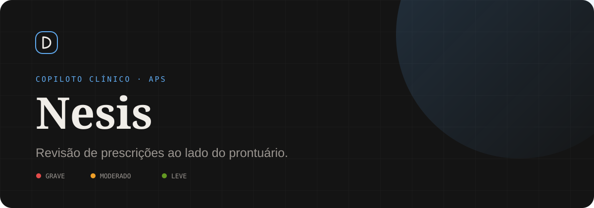
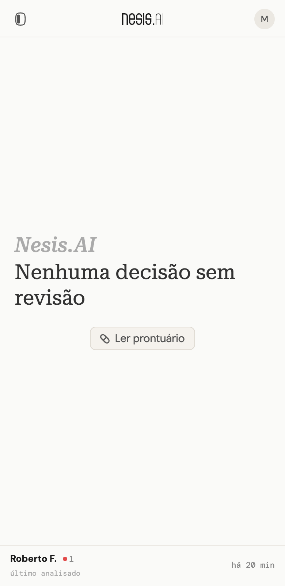
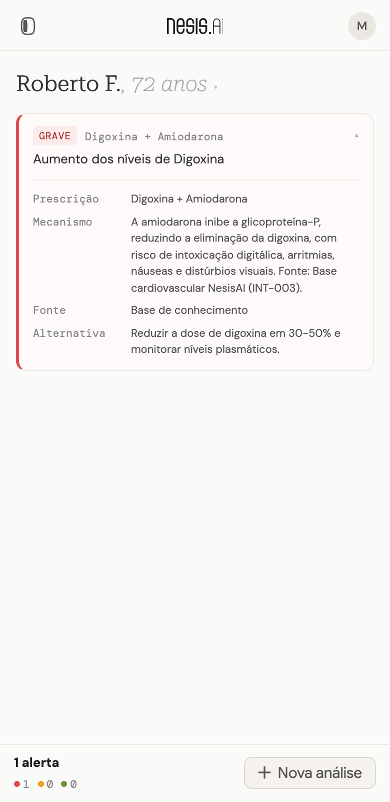
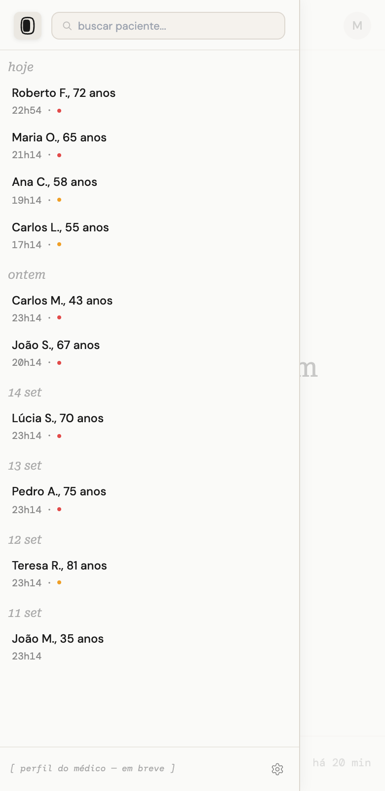
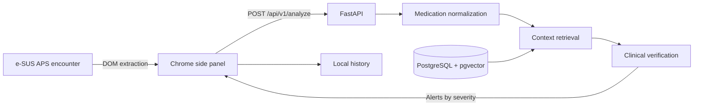

<div align="center">
  
  <br /><br />
  <p>
    <code>CHROME EXTENSION</code>&nbsp;&nbsp;·&nbsp;&nbsp;
    <code>FASTAPI</code>&nbsp;&nbsp;·&nbsp;&nbsp;
    <code>RAG + PGVECTOR</code>&nbsp;&nbsp;·&nbsp;&nbsp;
    <code>GEMINI</code>
  </p>
  <p><a href="#interface">Interface</a> · <a href="#quick-start">Quick start</a> · <a href="#architecture">Architecture</a> · <a href="#project-status">Project status</a></p>
</div>

Nesis is a prescription-review copilot for physicians in Brazil's public health system. It runs as a Chrome side panel next to the electronic patient record, reads the current encounter, and flags drug interactions and prescribing errors before the prescription is finalized.

**SUS** (*Sistema Único de Saúde*) is Brazil's universal public health system, and **APS** (*Atenção Primária à Saúde*) is its primary care level. About [70% of primary care clinics](https://www.scielo.br/j/rsp/a/7jZL8DrBTxtGjDBzCTRBCGH/) with electronic records use **e-SUS APS**, the Ministry of Health's record system. Prescribing errors such as drug interactions, overdoses, and prescriptions that conflict with a known allergy still happen often in this setting and can cost lives. Nesis aims to reduce them simply, by checking each prescription against the data already in the record.

Built during a hackathon, the prototype sends structured clinical data to an AI pipeline. Alerts come back with a severity level, an explanation, a recommendation, and a source label. Physicians can review the extracted data, edit it, and request another analysis.

> **Hackathon prototype.** This project has not been clinically validated. Use fictional data for development and demonstrations; it is not ready for patient-care decisions.

<a id="interface"></a>

## 01 · Interface

Actual frontend captures using the fictional examples bundled with the project. The results shown are saved demo records, not a live model evaluation.

<table>
  <tr>
    <th>Start an analysis</th>
    <th>Review a result</th>
    <th>Browse local history</th>
  </tr>
  <tr>
    <td></td>
    <td></td>
    <td></td>
  </tr>
</table>

The interface is in Brazilian Portuguese, the language of its users. It includes light and dark themes, editable patient and prescription details, and dedicated states for missing data, unavailable services, unsupported pages, and empty results. Typography combines Roboto Serif, DM Sans, DM Mono, and Google Sans.

## 02 · What it does

- Extracts encounter data from supported e-SUS APS pages using mapped XPaths and heuristic fallbacks.
- Normalizes medication names to the **DCB** (*Denominação Comum Brasileira*), Brazil's official nonproprietary drug names, comparable to INN.
- Retrieves context from 41 cardiovascular knowledge entries stored in PostgreSQL with pgvector.
- Classifies each alert as **GRAVE** (severe), **MODERADO** (moderate), or **LEVE** (mild).
- Lets the user correct extracted data and reanalyze without scraping again.
- Keeps analysis history and settings in browser `localStorage`.

API field names and severity values stay in Portuguese to match the interface and the source records.

<a id="architecture"></a>

## 03 · Architecture



| Layer | Implementation |
|---|---|
| Extension | React 18, TypeScript, Vite 8, Manifest V3, Side Panel API |
| API | FastAPI, Pydantic, SQLAlchemy, Alembic |
| AI | Gemini chat through LangChain; embeddings through `google-genai` |
| Retrieval | `langchain-postgres`, PostgreSQL 16, pgvector |
| Local infrastructure | Docker Compose with a named database volume |

The engine currently uses Gemini. Self-hosted models, AWS deployment, and adapters for other record systems are possible next steps, not shipped features.

<a id="quick-start"></a>

## 04 · Quick start

### Explore the frontend without a backend

Requires Node.js `^20.19.0` or `>=22.12.0` and npm.

```bash
cd frontend
npm ci
npm run dev
```

Open the local URL printed by Vite. Use the top-left menu to open the fictional history and select a saved result. You can inspect the UI without an API key. Running a new analysis requires the backend; extracting a record requires the installed Chrome extension.

### Run the backend

Requires Docker Compose and a Gemini API key for model calls and knowledge ingestion.

```bash
cd backend
cp .env.example .env
# Set GEMINI_API_KEY in .env.
docker compose up --build
```

In another terminal, populate the knowledge base:

```bash
cd backend
docker compose exec backend python scripts/ingest_knowledge.py
```

API documentation: [localhost:8000/docs](http://localhost:8000/docs). Health endpoint: [localhost:8000/health](http://localhost:8000/health).

The `.env` file is supplied at runtime and excluded from the Docker image. Database data persists in a named volume. Rebuild the image after backend source changes.

### Install the extension

```bash
cd frontend
npm run build:extension
```

1. Open `chrome://extensions` in Chrome and enable **Developer mode**.
2. Choose **Load unpacked** and select `frontend/dist/`.
3. Open a supported e-SUS APS encounter and click the Nesis icon.
4. Start the analysis from the side panel.

The current scraper checks for `lista-atendimento/atendimento` in the active URL. Access also depends on the manifest's host permissions. The API address is currently fixed to `http://localhost:8000`.

## 05 · Development checks

Frontend type checking and extension build:

```bash
cd frontend
npm run build:extension
```

Backend API tests, after installing `backend/requirements.txt` in a virtual environment:

```bash
cd backend
python -m pytest
```

The API tests replace the AI engine with deterministic responses. They require no database or model credentials and do not measure clinical accuracy.

## 06 · Repository map

```text
backend/
  app/motor/           AI engine: normalization, prompts, retrieval, verification
  app/prescriptions/   API schemas, route, and response aggregation
  data/                Cardiovascular knowledge base
  scripts/             Knowledge ingestion
  tests/               API contract tests
  alembic/             Database migrations
frontend/
  src/components/      Sidebar, drawer, alerts, and UI states
  src/scraper/         e-SUS APS DOM extraction
  src/stores/          Local history and settings
  public/              Extension manifest, service worker, and icons
docs/images/           Frontend screenshots for this README
pitch/                 Original hackathon presentation (Portuguese)
```

<a id="project-status"></a>

## 07 · Project status

This repository preserves the working hackathon scope. Important limitations:

- Some engine failures currently produce an empty alert list, indistinguishable from a completed analysis with no alerts.
- Retrieval falls back to model knowledge when the vector store is unavailable; source labels are not independently verified citations.
- Scraping depends on the e-SUS APS page structure and has not been generalized to other record systems.
- History contains bundled fictional examples and is stored locally. Resetting memory restores those examples while keeping settings.
- Patient data is not anonymized. Excluding the name from the verification prompt does not sanitize free-text fields or the API payload.
- The `analises` (analyses) database schema exists, but analysis persistence is disabled; the active history is in the browser.

## 08 · Further reading

- [Backend and API contract](backend/README.md)
- [Docker workflow](backend/README_DOCKER.md)
- [Backend development](backend/README_DEV.md)
- [AI pipeline and failure behavior](backend/app/motor/README.md)
- [Extension development](frontend/README.md)
- [Original hackathon pitch](pitch/nesis_pitch.html) (Portuguese)
- [Repository context](AGENTS.md)

## License

No license has been selected yet. Public availability of the repository does not grant an open-source license.
